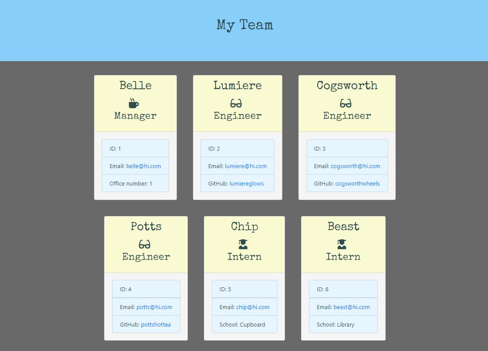

# Employee Template Engine

## Description

A node CLI app that intakes employee information for a team and outputs an HTML file displaying each employee inputted.

## Table of Contents

- [Demonstration](#demonstration)
- [Installation](#installation)
- [Usage](#usage)
- [License](#license)
- [Contributing](#contributing)
- [Tests](#tests)
- [Questions](#questions)

## Demonstration

The resulting team page will look like:

https://drive.google.com/file/d/1bmnnQZ1rufi3SERUS8mnSxeTdocZFkgp/view

## Installation

This app uses node. Using the command line, type "npm install" or "npm i" to run.

## Usage

Using the command line, run "node app.js" to prompt inquirer. Input employee information for your team. The resulting HTML file will be created within ./Develop/output.

## License

This project is licensed with MIT

## Contributing

Contact me at the information provided below.

## Tests

Tests are located within ./Develop/test and check employee classes. There are four tests for the four classes: Employee, Manager, Engineer, Intern.

## Questions

https://github.com/kcushing1

If you have any additional questions, please send an email to kasey.cushing@gmail.com
